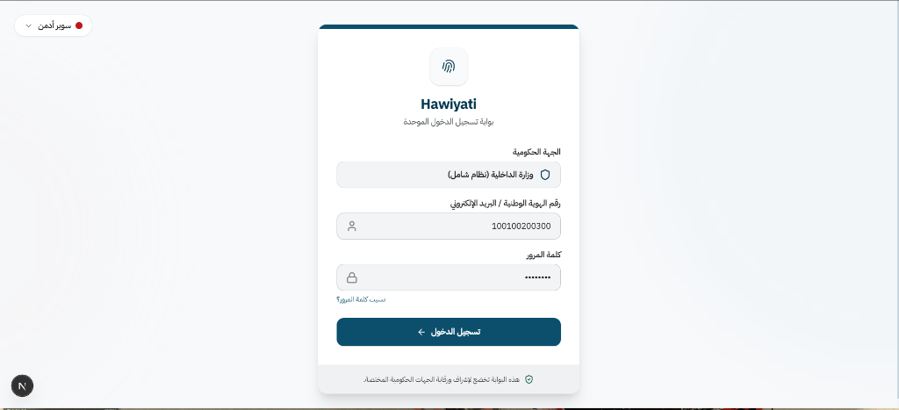
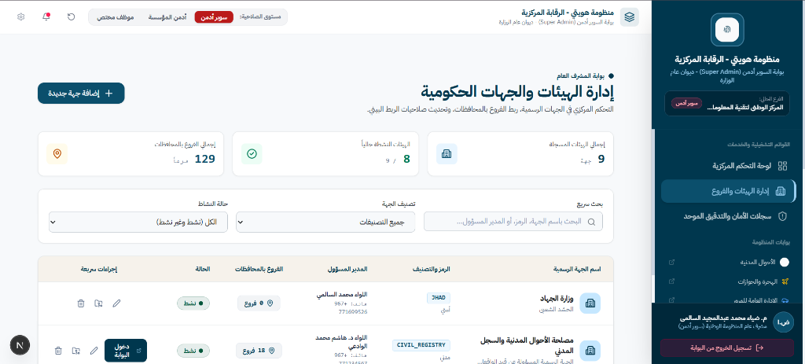
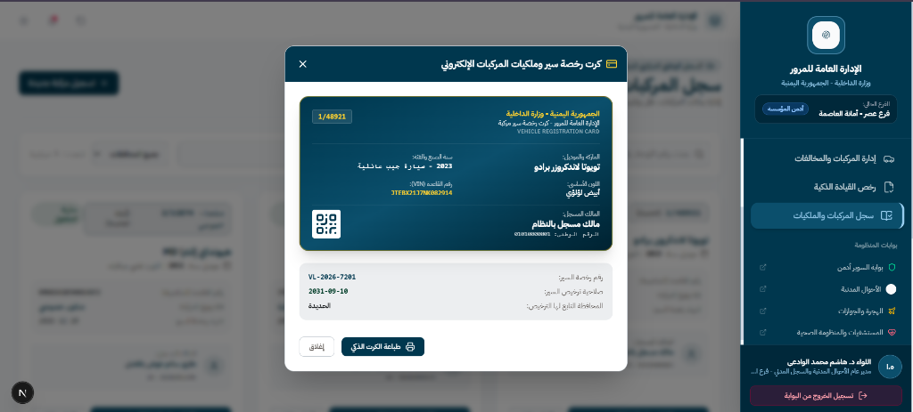
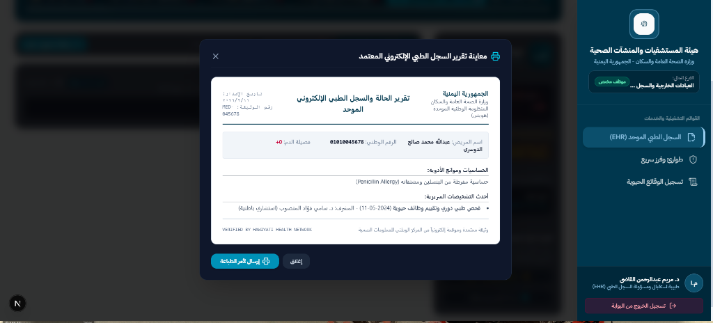

<div align="center">

# 🏛️ منظومة هويتي | Huwiyati Digital Identity & Portals
### الواجهة الأمامية للمنظومة الوطنية الموحدة لإدارة الهوية الرقمية والخدمات الحكومية
**Frontend for the Centralized National Digital Identity & E-Government Services Platform**

<br/>

[](https://nextjs.org/)
[](https://react.dev/)
[](https://www.typescriptlang.org/)
[](https://tailwindcss.com/)

</div>

---

## 📖 نبذة عن المشروع | Overview

### 🇸🇦 بالعربية
**منظومة "هويتي"** هي منصة ويب موحدة ومتكاملة تقدم واجهات متقدمة للجهات الحكومية والمؤسسات الوطنية لإدارة الهوية الرقمية، السجلات المدنية، بيانات المرور، الجوازات، والمنظومة الصحية (السجل الطبي الموحد). تم بناء الواجهة لتوفر تجربة مستخدم آمنة، سريعة، ومتجاوبة بالكامل مع دعم مخصص للغة العربية ونظام صلاحيات متقدم متعدد الأدوار (Super Admin, Organization Admin, Officers).

### 🇬🇧 In English
**Huwiyati** is a centralized digital identity and e-government web platform providing specialized multi-portal interfaces for governmental entities. It integrates Civil Registry, Traffic & Vehicle Licensing, Passports & Immigration, and Healthcare Systems (Unified Electronic Health Records - EHR). Built with modern web technologies, it offers a secure, responsive, and role-based operational experience.

---

## 📸 معـاينة الواجهات | Screenshots & UI Preview

<div align="center">

### 1️⃣ بوابة تسجيل الدخول الموحدة | Single Sign-On (SSO) Portal
واجهة تسجيل دخول آمنة تدعم المصادقة الموحدة للجهات والموظفين مع تحديد مستوى الصلاحية والجهة التابع لها.



<br/>

### 2️⃣ بوابة الرقابة المركزية (Super Admin) | Central Oversight & Agency Management
لوحة تحكم للمشرف العام لإدارة الجهات الحكومية، الفروع في المحافظات، صلاحيات الربط البيني، وسجلات التدقيق والأمان الموحد.



<br/>

### 3️⃣ بوابة الإدارة العامة للمرور | Traffic & Vehicle Registration Portal
إدارة المركبات والمخالفات، رخص القيادة الذكية، وعرض وطباعة كروت رخص السير والملكيات الإلكترونية المزودة بـ QR Code للتحقق الفوري.



<br/>

### 4️⃣ بوابة هيئة المستشفيات والمنظومة الصحية | Healthcare & Unified EHR Portal
إدارة السجل الطبي الإلكتروني الموحد للمواطنين (EHR)، فرز الطوارئ، فصائل الدم والحساسيات، ومعاينة التقارير الطبية المعتمدة رقمياً.



</div>

---

## 🌟 البوابات والأنظمة الفرعية | Integrated Portals

| البوابة / النظام | الوصف |
| :--- | :--- |
| **🛡️ الرقابة المركزية (Super Admin)** | إدارة كافة الهيئات الحكومية، صلاحيات الربط، ومراقبة تدقيق العمليات (Audit Logs). |
| **📑 مصلحة الأحوال المدنية** | إدارة طلبات الهوية، تفعيل البطاقات الذكية، وتسجيل الوقائع الحيوية (المواليد والوفيات). |
| **🚗 الإدارة العامة للمرور** | إصدار وتجديد رخص السير والقيادة، نقل الملكيات، وطباعة الكروت الذكية. |
| **✈️ مصلحة الهجرة والجوازات** | معالجة طلبات الجوازات، تتبع حركة السفر والمنافذ الحدودية، وإدارة السجلات. |
| **🏥 هيئة المستشفيات والمنشآت الصحية** | السجل الطبي الإلكتروني الموحد (EHR)، قسم الطوارئ والفرز، والتقارير الطبية المعتمدة. |

---

## 🛠️ التقنيات المستخدمة | Tech Stack

- **Framework:** [Next.js 15](https://nextjs.org/) (App Router)
- **Library:** [React 19](https://react.dev/)
- **Language:** [TypeScript](https://www.typescriptlang.org/)
- **Styling:** [Tailwind CSS v4](https://tailwindcss.com/)
- **Icons:** [Lucide React](https://lucide.dev/)
- **Utilities:** `clsx`, `tailwind-merge`

---

## 🚀 تشغيل المشروع محلياً | Getting Started

### المتطلبات الأساسية
- تثبيت [Node.js](https://nodejs.org/) (الإصدار 18 أو أحدث)
- مدير الحزم `npm` أو `yarn` أو `pnpm`

### خطوات التثبيت والتشغيل:

```bash
# 1. استنساخ المستودع
git clone https://github.com/YOUR_USERNAME/Huwiyati-Frontend.git

# 2. الدخول إلى مجلد المشروع
cd Huwiyati-Frontend

# 3. تثبيت الاعتماديات
npm install

# 4. تشغيل خادم التطوير
npm run dev
```

افتح المتصفح على الرابط [http://localhost:3000](http://localhost:3000) لاستعراض التطبيق.

---

## 📂 هيكل المجلدات | Project Structure

```
├── docs/
│   └── screenshots/          # صور ومعاينات واجهات النظام
├── src/
│   ├── app/
│   │   ├── (auth)/login/     # بوابة تسجيل الدخول
│   │   └── (portals)/        # بوابات الأنظمة الحكومية المختلفة
│   │       ├── admin/        # لوحة الرقابة المركزية
│   │       ├── civil-registry/# بوابة الأحوال المدنية
│   │       ├── hospitals/    # بوابة المستشفيات والملف الطبي
│   │       ├── passports/    # بوابة الجوازات والهجرة
│   │       └── traffic/      # بوابة الإدارة العامة للمرور
│   ├── components/           # المكونات والعناصر المشتركة
│   └── lib/                  # دوال المساعدة والإعدادات
└── package.json
```

---

<div align="center">
  <sub>تم تطوير واجهة النظام كجزء من مشروع التخرج / المنظومة الوطنية الموحدة © 2026</sub>
</div>
